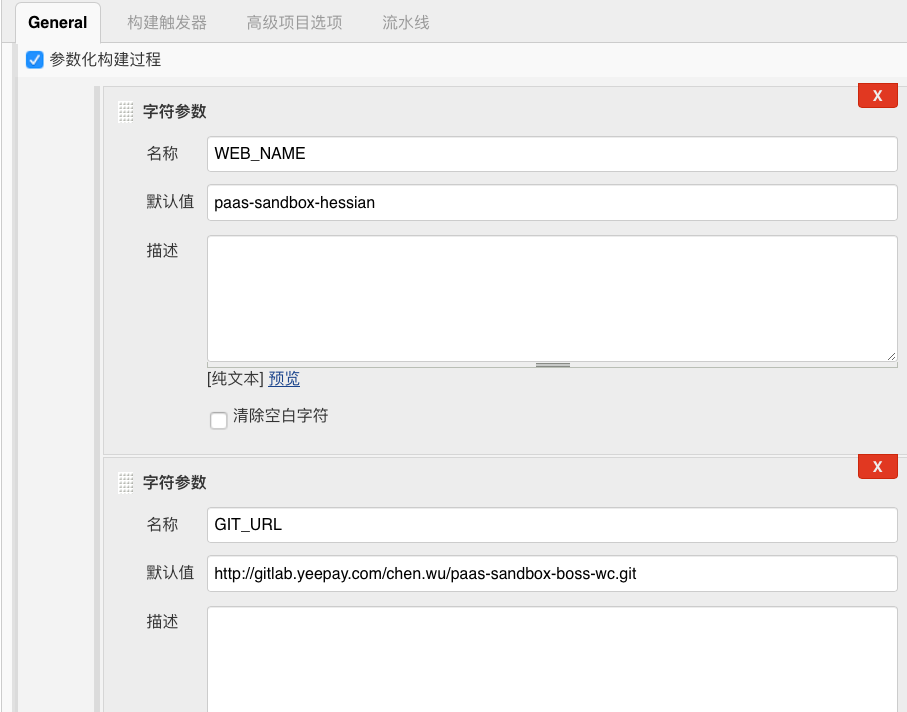
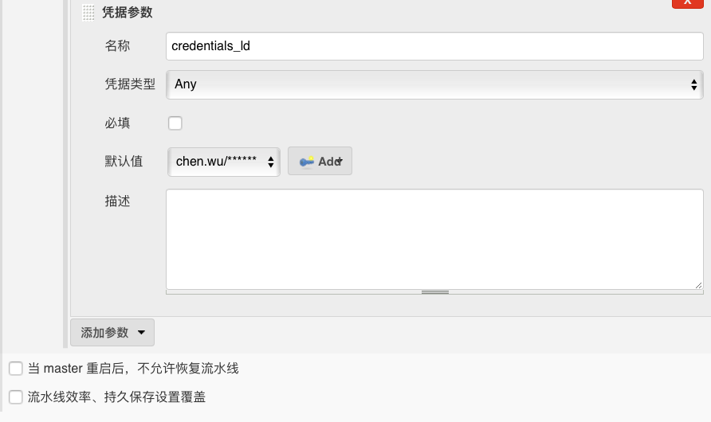

## jenkins的k8s部署及应用
### 一. 环境
    1.CI/CD集群下部署应用（注意：credential没有添加成功，因此使用了不安全的8080端口）
    2.jenkins镜像为 jenkinsci/jenkins (docker search jenkins可以找到所需镜像)
### 二. 部署 Jenkins
####    1 . 按照以下顺序分别使用kubectl命令创建这四个文件：
        1).    kubectl create -f pv-jenkins.yml
        2).    kubectl create -f pvc-jenkins.yml
        3).    kubectl create -f jenkins-statefulset.yml
        4).    kubectl create -f jenkins-service.yml
    其中文件内容所在的地址为：https://github.com/penpenpenpen/jenkins-k8s-ci
####    2 . 设置jenkins
   1). 获取外部访问jenkins的端口(这里为30085)，ip为CI/CD集群下的任意节点ip，这里选用10.151.33.87
 

 
 

   2). 按照jenkins界面的提示逐步操作，得到下面界面
 

 
 

   3). 点击 “系统管理” —> “管理插件” —> “可选插件” —> “Kubernetes ” 勾选安装
 

 
 

  4).  点击 “系统管理” —> “系统设置” —> “新增一个云” —> 选择 “Kubernetes”，然后填写 Kubernetes 和 Jenkins 配置信息     
  (其中Jenkins地址的ip为CLUSTER-IP(这里为172.29.32.50)，端口为8080，Kubernetes地址的ip为10.151.33.87，端口为8080） 
 

 
 

 
### 三. java项目构建
####    1. 镜像构建
        1）在centos镜像中安装docker , java(1.8) , maven    
        2)  加入repository文件，setting文件
        3）安装，配置frog
        4）安装zip
        5）加creditiel证书
        6）将宿主机/root/.docker/config.json    /etc/docker/certs.d/artifact.paas.yp/domain.crt挂载到容器上
####    2. pipeline设置
   1）选择参数化构建过程，按照下图顺序依次进行设置
 

 
 

 

 
 
 
  

 
 

    2）在命令框中输入脚本pipeline（内容地址为https://github.com/penpenpenpen/jenkins-k8s-ci/blob/master/pipeline）
    
##### 参考文件
（1）https://github.com/jenkinsci/kubernetes-plugin

（2）https://blog.csdn.net/aixiaoyang168/article/details/79767649
